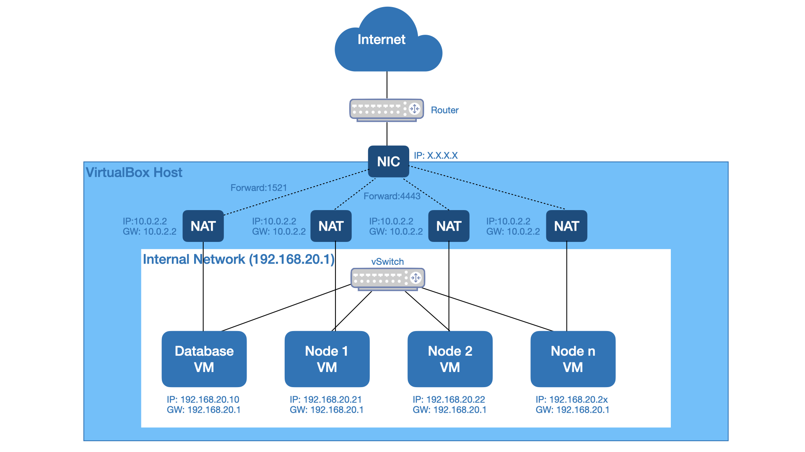

# vagrant-atomsphere-dev

This vagrant configuration provides a multiple VM setup with CentOS 7. It contains a VM with a database and (configurable) number of "nodes". The following graphic illustractes the setup:



The VM's build as follow:

## Database-Machine:
* CentOS 7 without a desktop
* Flyway
* Oracle XE Database 18c
* [Oracle Sample Schemas loaded into XE database](https://github.com/oracle/db-sample-schemas)

Please use the user vagrant/vagrant to login into the virtual machine. manager10g is used as password for all Oracle components, like Database and all sample schemas.

Port 1521 (Oracle XE) and 5500 (Enterprise Manager) are automatically exposed by the VM.

## Node-Machine's:
* CentOS 7 without a desktop
* Open JDK 11

Please use the user vagrant/vagrant to login into the virtual machine.

Port xx is automatically exposed by the VM.

All nodes using an internal network with fixed ip adresses to communicate to each other. Externally the VM's can be access with NAT and port forwarding.

## Installation and Configuration Steps

1. Oracle Virtual Box is installed and configured on your development machine.
   ([http://www.oracle.com/technetwork/server-storage/virtualbox/downloads/index.html](http://www.oracle.com/technetwork/server-storage/virtualbox/downloads/index.html))

2. Vagrant is installed and configured on your development machine.
   ([https://www.vagrantup.com/downloads.html](https://www.vagrantup.com/downloads.html))

3. Clone the project from git. The target folder named as PROJECT_HOME afterwards.

   ```
   $ git clone https://...
   ```
4. Download Oracle Database Express Edition 18c to $PROJECT_HOME/provision/OracleXE/oracle-database-xe-18c-1.0-1.x86_64.rpm
   ([http://download.oracle.com/otn/linux/oracle18c/xe/oracle-database-xe-18c-1.0-1.x86_64.rpm](http://download.oracle.com/otn/linux/oracle18c/xe/oracle-database-xe-18c-1.0-1.x86_64.rpm))

5. You can fine tune the configuration by open the vagrant file. The following settings can be modified when the default is not suitable:

   ```
    s.env = {
             ORACLE_SID: "XE",
             ORACLE_PASSWORD: "manager10g", => Password for Oracle XE database.
             ORACLE_CHARACTERSET: "AL32UTF8",
             ORACLE_BASE: "/opt/oracle", => Base directory where all Oracle software will be installed.
             ORACLE_HOME: "/opt/oracle/product/18c/dbhomeXE"
            }
   ```

6. Configure the number of nodes needed in vagrant file:

   ```
   NODE_COUNT = 2 //default number of nodes
   ```

7. Open a shell on your development machine and navigate to the folder PROJECT_HOME. Start and provision all VM's:

   ```
   $ vagrant up
   ```

## Usage

### Start all VM's

1. Open a shell on your development machine and navigate to the folder PROJECT_HOME

2. Execute start command

   ```
   $ vagrant up
   ```

**Note:** Start only a specific VM using the corresponding name like `vagrant up database`.

### Stop all VM's

1. Open a shell on your development machine and navigate to the folder PROJECT_HOME

2. Execute stop command

   ```
   $ vagrant halt
   ```

**Note:** Stop only a specific VM using the corresponding name like `vagrant halt database`.

### Login to Virtual machine

1. Open a shell on your development machine and navigate to the folder PROJECT_HOME

2. Execute stop command

   ```
   $ vagrant ssh database [node1 | node2 | nodeN]
   ```

**Note:** You can sudo su - oracle to switch to the oracle user. The oracle user owns the db installation. Only applicable for the database VM!

### Update Virtual Machine

1. Open a shell on your development machine and navigate to the folder PROJECT_HOME

2. Pull the latest changes from the git repository

3. Execute the following command. The virtual machine must be started!

   ```
   $ vagrant rsync
   $ vagrant provision
   ```

### Connecting to Oracle Database

- Hostname: localhost
- Port: 1521
- SID: XE
- PDB: XEPDB1
- EM Express port: 5500
- All passwords are auto-generated and printed on install

### Resetting password
You can reset the password of the Oracle database accounts (SYS, SYSTEM and PDBADMIN only) by switching to the oracle user (sudo su - oracle), then executing /home/oracle/setPassword.sh <Your new password>.

### Start/Stopp Oracle Database

1. Open a shell on your development machine and navigate to the folder PROJECT_HOME

2. stop command

   ```
   $ vagrant ssh database
   $ sudo -s
   $ /etc/init.d/oracle-xe-18c stop
   ```

3. start command

   ```
   $ vagrant ssh database
   $ sudo -s
   $ /etc/init.d/oracle-xe-18c start
   ```

### Post Installation Steps

### Issues
